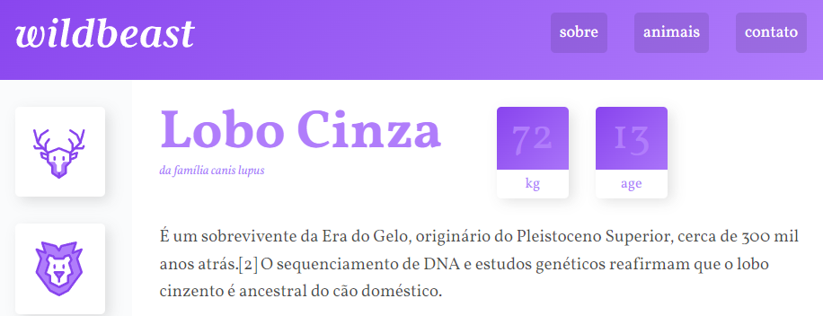
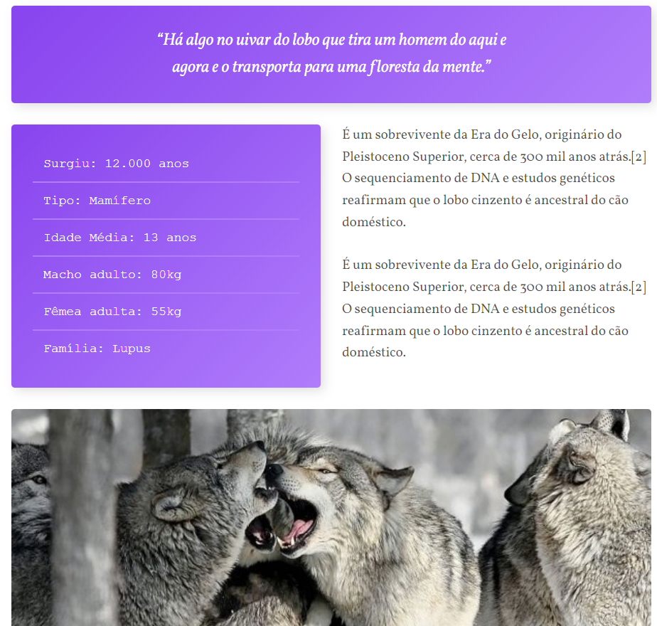

# Wildbeast

Um site sobre lobos utilizando CSS Grid Layout para criar um design responsivo e moderno.

## Interface

<div align="center">
  
</div>

## Sumário

- [Tecnologias Utilizadas](#tecnologias-utilizadas)
- [Status](#status)
- [Descrição](#descrição)
- [Funcionalidades](#funcionalidades)
- [Explicação](#explicação)
- [Como Usar](#como-usar)
- [Autor](#autor)

## Tecnologias Utilizadas

<div style="display: flex; flex-direction: row;">
  <div style="margin-right: 20px; display: flex; justify-content: flex-start;">
    
  </div>
  <div style="margin-right: 20px; display: flex; justify-content: flex-start;">
    
  </div>
</div>

## Status


## Descrição

Wildbeast é um site informativo sobre lobos, utilizando CSS Grid Layout para organizar e exibir o conteúdo de maneira atraente e responsiva.

<div align="center">
  
</div>

<br></br>

## Funcionalidades

- Navegação entre seções do site (Sobre, Animais, Contato).
- Exibição de informações detalhadas sobre o lobo cinza.
- Inclusão de imagens e citações relacionadas aos lobos.
- Seção de anúncios.

## Explicação

Exemplo de código do projeto:

```html
<header class="header">
  <a href="#" class="logo"></a>
  <nav>
    <ul>
      <li><a href="#">sobre</a></li>
      <li><a href="#">animais</a></li>
      <li><a href="#">contato</a></li>
    </ul>
  </nav>
</header>
```

## Como Usar

`1.` Clone o repositório para o seu ambiente local.

`2.` Abra o arquivo index.html no seu navegador preferido.

`3.` Navegue pelas diferentes seções do site.

## Autor
Desenvolvido no curso de Grid Layout da Origamid.

sobre esse projeto 
foi um projeto de grtande valor 